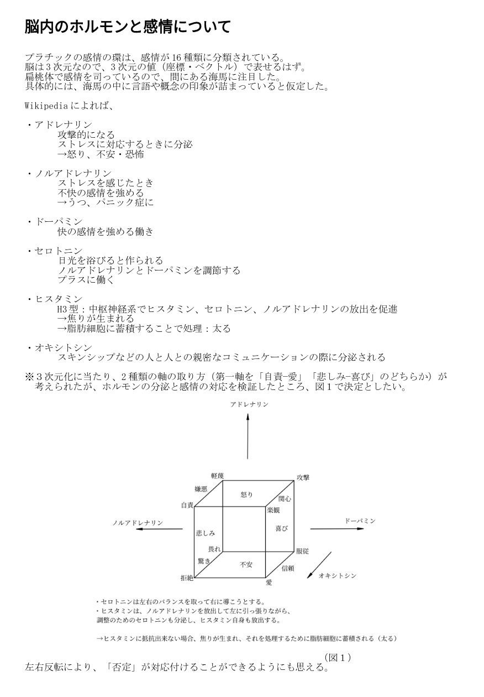
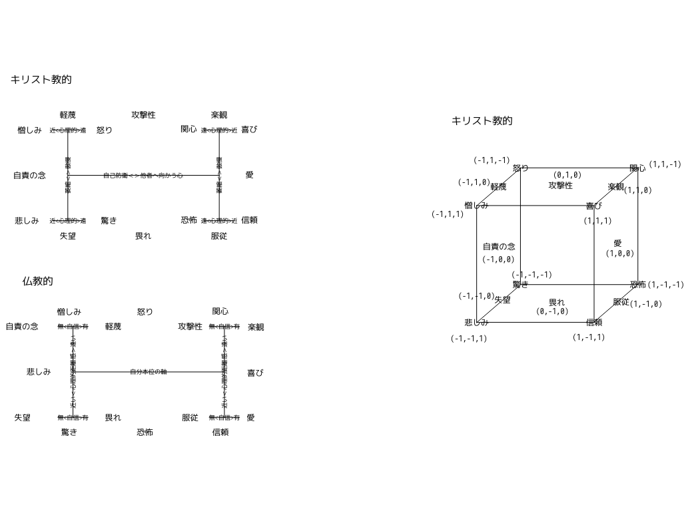

# emotionView
Emotion Graph

Ver.2
脳内のホルモンと感情について

プラチックの感情の環は、感情が16種類に分類されている。
脳は3次元なので、3次元の値（座標・ベクトル）で表せるはず。
扁桃体で感情を司っているので、間にある海馬に注目した。
具体的には、海馬の中に言語や概念の印象が詰まっていると仮定した。

Wikipediaによれば、

・アドレナリン

攻撃的になる

ストレスに対応するときに分泌

→怒り、不安・恐怖

・ノルアドレナリン

ストレスを感じたとき

不快の感情を強める

→うつ、パニック症に

・ドーパミン

快の感情を強める働き

・セロトニン

日光を浴びると作られる

ノルアドレナリンとドーパミンを調節する

プラスに働く

・ヒスタミン

H3型：中枢神経系でヒスタミン、セロトニン、ノルアドレナリンの放出を促進

→焦りが生まれる

→脂肪細胞に蓄積することで処理：太る

・オキシトシン

スキンシップなどの人と人との親密なコミュニケーションの際に分泌される

※３次元化に当たり、2種類の軸の取り方（第一軸を「自責−愛」「悲しみ−喜び」のどちらか）が
　考えられたが、ホルモンの分泌と感情の対応を検証したところ、図１で決定としたい。

当初、以下の２種類の軸の取り方を想定していました。

